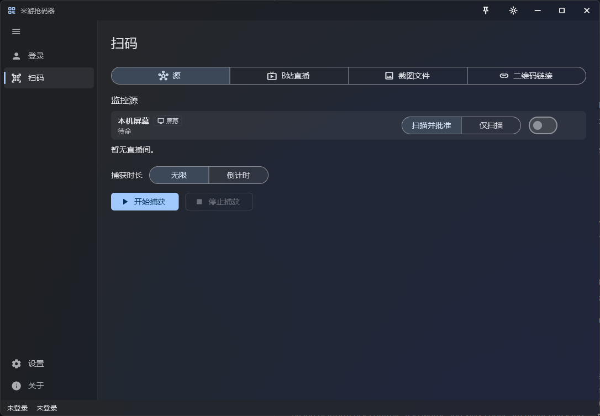

# mhy-QRscanner（米游抢码器）

[中文](README.md) | [English](README.en.md) | **日本語**

[](https://github.com/nekwken/mhy-QRscanner/releases)

[](LICENSE)

> **機械翻訳について** — この文書は中国語版 [README.md](README.md) を AI で翻訳したものです。
> 内容に食い違いがある場合は中国語版が優先されます。
<!-- readme-source-sha256: 86ce1f6d08c32fe392b90710072ad855868d854224027f51846c9b1c5aee1c32 -->

MiHoYo のゲームライブ配信向け**搶碼（QR レース）**ツール — Windows デスクトップクライアント。

> ⚠️ **本人のアカウント・本人の端末**でのみ使用してください。
> 使用前に[利用範囲と免責事項](#利用範囲と免責事項)をお読みください。

仕組み：MiHoYo 通行証のセッションを仮想デバイスに常駐させ、**Bilibili のライブ配信**や
**自分の画面**から QR コードを取り込み、その常駐セッションで承認します。より速く、より手軽に
搶碼（レース）に勝つためのツールです。



## 機能

このツールは本質的に、米游社のスキャンログイン機能のサードパーティクライアントです。

- アカウントのパスワードまたは携帯の認証コードで MiHoYo 通行証にログインできます
  （⚠️ 認証コードの取得には手動での人機認証が必要になる場合があります）
- ログイン後は米游社モバイルクライアントとしてログインを承認できます。原理的には米游社の
  スキャナ機能と同じです
- 複数のソースから同時に搶碼し、最初に QR コードが現れたログインを承認します

## ダウンロードと実行

[Releases](https://github.com/nekwken/mhy-QRscanner/releases) から Windows x64 のアーカイブを
ダウンロードし、展開して `mhy_QRscanner.exe` を実行してください（インストール不要）。
配布パッケージは 2 種類あります：

| 版 | ファイル名 | 説明 |
|---|---|---|
| スリム版 | `mhy-QRscanner-v<バージョン>-windows-x64.zip` | ffmpeg が既にインストールされている環境向け |
| **ffmpeg 同梱** | `mhy-QRscanner-v<バージョン>-windows-x64-with-ffmpeg.zip` | 展開するだけで動作、ライブ取得に ffmpeg 不要 |

動作要件：

- Windows 10/11 x64
- Bilibili のライブソースには [ffmpeg](https://ffmpeg.org/download.html) が必要です。探索順は
  `MHYQR_FFMPEG` 環境変数 → プログラムと同じフォルダーの `ffmpeg.exe`（同梱版）→ `PATH` 上の
  `ffmpeg`。（画面監視・スクリーンショット・QR リンクのみなら ffmpeg は不要です）
- 同梱の ffmpeg は LGPL ビルド（BtbN/FFmpeg-Builds）で、`FFMPEG-LICENSE.txt` を同梱しています

## クイックスタート

1. **ログイン**：アカウントページでパスワードまたは SMS コードで MiHoYo 通行証にログインします。
2. **ソース設定**：スキャンページには 4 つのタブがあります —
   - **Bilibili**：配信部屋を登録（部屋番号 + ラベル）
   - **ローカル画面**：画面全体を監視
   - **スクリーンショット / QR リンク**：単発のシングルソーススキャン

   「ソース」タブのカードで各ソースの有効/無効を切り替え、モード（スキャンのみ／スキャンして承認）を
   設定します。
3. **レース**：「キャプチャ開始」を押します。QR コードが認識されると、各ソースのモードに従って
   自動承認されるか、再確認のダイアログが表示されます。

コマンドラインの使い方は [CLI](#cli) を参照してください。

## ソースからのビルド

ツールチェーン：Rust 1.98.1、Flutter 3.47.3（`flutter_rust_bridge` 2.13.0 はバインディング再生成時のみ必要）。

```powershell
# Rust の release 成果物をビルドし、次に Flutter Windows アプリをビルドして、
# mhy_qrscanner_bridge.dll を mhy_QRscanner.exe の隣に配置します（アプリはそこから読み込みます）。
powershell -NoProfile -ExecutionPolicy Bypass -File app\tool\build_windows.ps1

# ffmpeg を同梱する場合はこのスイッチを追加（ffmpeg.exe と LICENSE が Release に入ります）：
powershell -NoProfile -ExecutionPolicy Bypass -File app\tool\build_windows.ps1 -BundleFfmpeg F:\ffmpeg\bin\ffmpeg.exe
```

> ビルドスクリプトは ASCII ジャンクション経由で動作し、Flutter の非 ASCII パス問題を回避します。
> 手動コマンドとバインディング再生成は `docs/HANDOVER.md` §4 にあります。

## CLI

```powershell
# 1. 仮想デバイス
cargo run -p mhy-qrscanner-cli -- device create --account my-acct --template xiaomi14
cargo run -p mhy-qrscanner-cli -- device register --account my-acct
cargo run -p mhy-qrscanner-cli -- device show --account my-acct

# 2. アカウントログイン（パスワード → SMS フォールバック → セッション有効化 → トークン交換）
$env:MHYQR_PASSWORD = "..."
cargo run -p mhy-qrscanner-cli -- auth login --account my-acct --login <電話番号>
cargo run -p mhy-qrscanner-cli -- auth show --account my-acct

# 3. ゲーム QR を 1 回だけ承認（リンクまたはスクリーンショット）
cargo run -p mhy-qrscanner-cli -- qr login-game --account my-acct --image <screenshot.png>
```

実測済みの流れ：PC で生成した仮想デバイスが `getExtList`/`getFp` で登録され、パスワードと
SMS のログインで `stoken` を取得し、`scanQRLogin` + `confirmQRLogin` で実際の PC クライアントが
ログインします。新デバイスのリスクチャレンジ（`-3235`）はユーザーが**手動**で完了するよう
表示されます。

## リポジトリ構成

```text
crates/
  mhy-qrscanner-core/     # ドメインモデルとエラー
  mhy-qrscanner-device/   # 仮想デバイス生成（5 テンプレート）+ 登録
  mhy-qrscanner-mihoyo/   # DS2 署名、RSA 資格情報、ログイン/検証/交換、x-rpc ヘッダー
  mhy-qrscanner-qr/       # panda + 通行証 QR、cookie 構築、ローカル QR デコード
  mhy-qrscanner-capture/  # Windows GDI 画面キャプチャ
  mhy-qrscanner-store/    # DPAPI 暗号化ストレージ
  mhy-qrscanner-cli/      # `mhyqr` コマンドライン
  mhy-qrscanner-bridge/   # Flutter FFI 境界（検証・マスク・転送）
app/            # Flutter Windows シェル
  lib/src/screens/  # アカウント / ログイン / スキャン / 設定 / アバウト
  lib/src/rust/     # 生成されたバインディング — 手で編集しないこと
  tool/build_windows.ps1
docs/
  HANDOVER.md   # 環境、ビルド手順、検証レベル、既知の罠（まずここから）
flutter_rust_bridge.yaml  # コード生成設定
```

## デバッグ用環境変数

通常の使用では不要です：

| 変数 | 用途 |
|---|---|
| `MHYQR_DEBUG` | stderr に詳細な診断を出力 |
| `MHYQR_PASSWORD` | `auth login` / `auth login-password` のパスワード |
| `MHYQR_SMS_CODE` | 受信済みの SMS コードを再送信せずに送信 |
| `MHYQR_QR_CONFIRM=1` | 旧 `qr scan`：`confirmQRLogin` も呼び出す |
| `MHYQR_APP_ID` / `MHYQR_CLIENT_TYPE` / `MHYQR_GAME_BIZ` | `x-rpc-*` の識別情報を上書き |
| `MHYQR_DEVICE_ID` / `MHYQR_DEVICE_FP` / `MHYQR_DEVICE_NAME` / `MHYQR_DEVICE_MODEL` / `MHYQR_SYS_VERSION` | デバイス識別情報を上書き |
| `MHYQR_FFMPEG` | ffmpeg 実行ファイルのパス |
| `MHYQR_BRIDGE_DLL` / `MHYQR_CLI_EXE` | テスト専用：`flutter test` に release cdylib と CLI の場所を伝える |

## 利用範囲と免責事項

- **本人のアカウント・本人の端末のみ**
- アカウントの安全は利用者自身の責任です。本ツールはログインのみを担当し、ログイン後の環境の
  安全やアカウントの安全を保証しません。
- 本ツールはパスワードを保存せず、ログイン状態のみをローカルに保存しますが、そのフォルダーには
  プライベートなファイルも生成されます。適切に管理してください。
- 本プロジェクトは非常に初期段階であり、多数のバグが存在する可能性があります。
- 本ツールの使用はゲームやプラットフォームの利用規約に違反する可能性があります。アカウントの
  リスクおよび一切の結果は利用者の責任です。本プロジェクトは学習・研究目的で公開されており、
  お住まいの地域の法令を遵守してください。

## ライセンス

MIT — [LICENSE](LICENSE) を参照してください。
